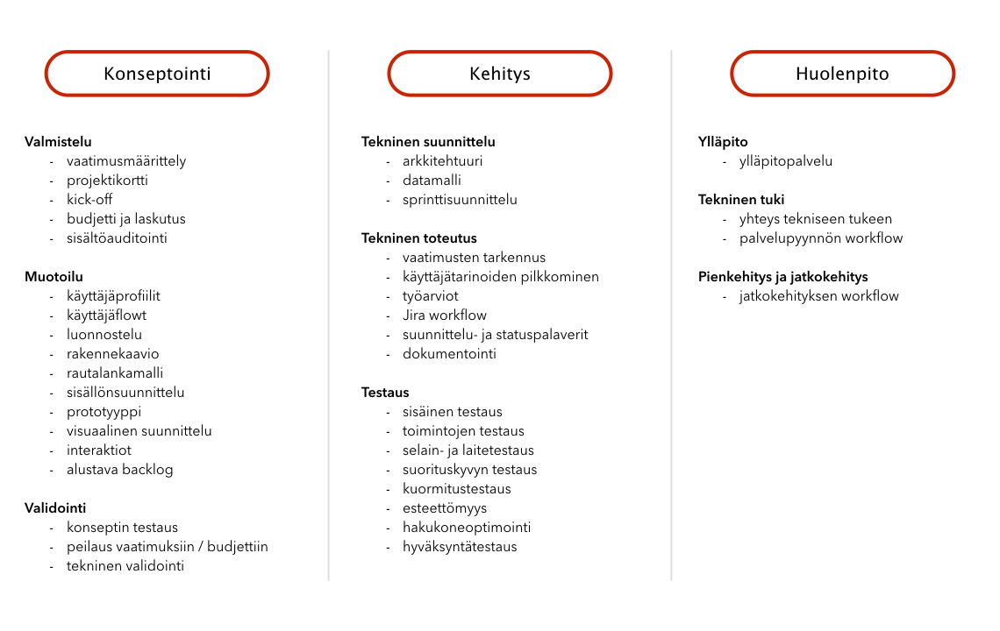

Tervetuloa tutustumaan Geniem Project Flow -projektimalliin. Täällä avataan Geniemillä käytössä olevaa projektimallia sen termistöineen, rooleineen, työvälineineen ja vaiheineen. Pyrkimyksenämme on ollut luoda projektimallista sellainen, että sitä seuraamalla saavutetaan aina onnistunut ja kaikkia osapuolia hyvin palveleva lopputulos, mutta sitä on myös helppo mukauttaa projektikohtaisesti projektin tavoitteisiin ja resursseihin sopivaksi. Emme ole halunneet luoda prosesseja tai malleja vain niiden itsensä vuoksi, vaan palvelemaan kokonaisuutta ja mukautumaan sopivassa suhteessa projektin luonteen mukaiseksi.

Sivusto on tarkoitettu ohjenuoraksi niin Geniemin henkilöstölle, kumppaneille kuin myös asiakkaalle. Ketterän kehityksen periaatteiden mukaisesti kehitämme myös projektimalliamme jatkuvasti, mutta voimme toisaalta sitoutua toimimaan myös pitkissä projekteissa asiakkaan kanssa sovitulla tavalla. Mikäli projektimalliin tulee uudistuksia, joiden uskomme palvelevan kokonaisuutta, tuomme niitä myös aktiivisesti esiin.

[Agile Manifeston](http://agilemanifesto.org/iso/fi/manifesto.html) sanoin:

*Yksilöitä ja kanssakäymistä enemmän kuin menetelmiä ja työkaluja.  
Toimivaa ohjelmistoa enemmän kuin kattavaa dokumentaatiota.  
Asiakasyhteistyötä enemmän kuin sopimusneuvotteluja.  
Vastaamista muutokseen enemmän kuin pitäytymistä suunnitelmassa.*

*Jälkimmäisilläkin asioilla on arvoa, mutta
arvostamme ensiksi mainittuja enemmän.*

## Roolit

**Myyjä** on asiakkaan ensimmäinen kontakti. Myyjä hoitaa projektin sopimuksen.

**Service Designer** toimii kuin projektin "ohjaajana". Hän vastaa asiakkaan kanssa konseptista, kehitettävän palvelun ilmeestä ja käytettävyydestä läpi projektin.

**Projektipäällikkö** on kuin projektin "tuottaja". Hän vastaa projektin käytännön asioista, kuten budjetista ja aikataulutuksesta. Projektipäällikkö selkeyttää service designerin kanssa asiakkaan vaatimuksia ja käyttäjätarinoita sekä varmistaa, että kehitystiimillä on kaikki tarvittava projektin toteuttamiseen.

**Dev Lead** vastaa projektin teknisestä arkkitehtuurista ja teknisestä laadusta.

**Kehittäjä** eli koodaaja vastaa teknisestä toteutuksesta.

**Testaaja** varmistaa laadun projektin aikana sekä ennen julkaisua. Testaaja vastaa laite- ja selaintestauksesta sekä toiminnallisuuksien testauksesta.

## Termit

**QA** = Quality Assurance. Laadunvarmistus, käytännössä testaus.

**hyväksymiskriteerit** = käyttäjätarinan vaatimukset, jotka on täytettävä ja pystyttävä demoamaan, esimerkiksi “- kenttään voi syöttää ainoastaan numeroita”

**issue** = Jirassa oleva “tiketti”, joka voi olla esimerkiksi käyttäjätarina (user story), tehtävä (task) tai bugi (bug).

**käyttäjätarina** = yhdellä lauseella kuvattu järjestelmän toiminnallisuus, jonka myös asiakas ymmärtää (ei teknistä jargonia)

**sprintti** = kehityssykli, tietty määrää aikaa jonka kuluessa tehdään etukäteen valitut ja suunnitellut työt. Kesto melko poikkeuksetta 2 viikkoa.

**taski** = suoritettava työtehtävä, joka ei ole käyttäjätarina, esimerkiksi “Tuotantoympäristön konfigurointi”

<!---
## Työvälineet
**Jira** on tehtävienhallintaan ja projektin seuraamiseen käytettävä työkalu. Kaikki projektin tehtävät ja käyttäjätarinat sijaitsevat Jirassa. Ne etenevät boardeiksi kutsutuissa näkymissä sitä mukaa, kun tehtävät edistyvät. Työtunnit logataan Jiraan.
**Confluence** on wikityökalu, joka sisältää pääasiallisesti projektien perustiedot ja sisäisiä ohjeita.
**Google Docs** sisältää kaiken projektikohtaisen materiaalin. 
**Slack** on väline tiimityöskentelyyn ja päivittäiseen kommunikaatioon. Jokaisella projektilla on oma kanavansa. Asiakkaat kutsutaan liittymään Geniemin Slack-tiimiin. Näin varmistetaan nopea ja selkeä kommunikaatio kehittäjien ja asiakkaan edustajien välillä. [Ohje Slackin käyttöön](https://get.slack.help/hc/en-us/categories/202622877-Slack-Guides)
-->

